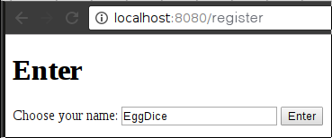
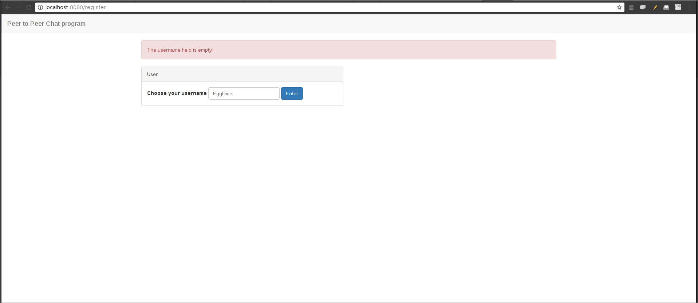

# Peer to Peer Chat application

*Write a chat application that connects to other peer applications and chat your
fellow Green Foxers*

## Tasks

### GitHub repository

- Fork this repository under your own account.
- Clone the forked repository to your computer.
- Add link to the README.md of your usual repository of this new forked repo.
- Add tag to your new, forked repository with the name of your class.
- Please commit your p2p-chat app updates to this repository.
- Don't forget to create .gitignore file.

### Set up the environments

#### Use environment variables
* About environment variables: [Windows](https://www.youtube.com/watch?v=bEroNNzqlF4), [Linux + Mac](https://www.youtube.com/watch?v=pjh9rU9h22Q)
* Reading environment variables in java: [This article](https://docs.oracle.com/javase/tutorial/essential/environment/env.html)
* Try your environment variables on heroku as well: [This article](https://devcenter.heroku.com/articles/config-vars)
* Create a `CHAT_APP_DB_URL` environment variable that stores the url to the local or remote database
* Create a `CHAT_APP_DB_USERNAME` environment variable that stores the username to the local or remote database
* Create a `CHAT_APP_DB_PASSWORD` environment variable that stores the password to the local or remote database

#### Development environment

* Host: localhost
* Database: a local SQL database

#### Production environment

* Host: Heroku
* Database: Postgre database on Heroku

e.g:


### Main page

Create a main page containing a heading that is accessible from the `/` route.


### Logging

Each http request should be logged to the standard out (`System.out.println()`). Also if any error has happened in the routes
it should log the error to the standard error (`System.err.println()`).
A log message should have the following fields:

 - **Path**: The path of the endpoint like: `/`
 - **Method**: The method of the endpoint like: `GET`
 - **Date and Time**: It should print the date in a format like this: `2017-05-16 21:47:19.040`
 - **Log Level**: `INFO` on http requests and `ERROR` on any occured error
 - **Request Data**: It should log all the request params from the endpoint

The log should look like this:
`2017-05-16 21:47:19.040 INFO Request /message POST text=apple`

The logs should be configurable by an environment variable called `CHAT_APP_LOGLEVEL`. If this variable is set to `ERROR` it should only print the error messages, any other cases it should print both error and info level mesages.

[Read the logs](https://devcenter.heroku.com/articles/logging) on heroku not just on your local machine, to
achive it first install the [heroku toolbelt](https://devcenter.heroku.com/articles/heroku-cli)

### Client Id, Peer address

Each application should store a unique id (string), that is different from any other. Please use your github username for this purpose.
Each application should store an IP address of an other application that it will connect to. This is the address where your application forwards the created or received chat messages.
Both of the values should be loaded from the following environment variables:
`CHAT_APP_UNIQUE_ID`, `CHAT_APP_PEER_ADDRESS`

### Register page

Create a new page at the `/register` path.



If the "Enter" button is clicked, it should create a new user in the database and redirect to the main page.

If the username is not specified, it should show an error on the top of the page: "The username field is empty".

At this point we handle only one user for the application:
- The Register page should redirect to the Main page if 1 user is present in the database
- The Main page should redirect to the Register page if 1 user is not present in the database

### Main page

Create a form under the title that consists a text input and an update button.


The text input should store the username of the user. If the update button is clicked, then it should update the username in your database (so we still have just 1 user in the database that you can modify).
After the update the application should stay or redirect back to this Main page.

If the username is not specified it should show an error on the top of the page: "The username field is empty".

### Save new message

Add a list of messages to your main page. Each message should have a `username` and a `text` field.

The page should have a default message in its list:

 - `username`: App
 - `text`: Hi there! Submit your message using the send button!

All the other messages should appear under this message.

Under the messages there should be a form that can add a new message.


If the send button is clicked, it should store a new message in the database and it should show up in the list.
Each message should have a stored:

 - `username`
 - `text`
 - `timestamp` when the message was created
 - Random generated `id` (between 1000000 - 9999999)


### Receive new message

Create a REST `POST` endpoint called `/api/message/receive`.

It should expect a JSON input:

```json
{
  "message": {
    "id": 7655482,
    "username": "EggDice",
    "text": "How you doin'?",
    "timestamp": 1322018752992
  },
  "client": {
    "id": "EggDice"
  }
}
```
(Where the client id is the identifier of the application client detailed in the next story)

When the endpoint is requested, it should save the message into the database.
Then it should response with a simple JSON object and a `200` status as response:

```json
{
  "status": "ok"
}
```

If any of the fields are missing, it should respond with `401` as status and a JSON
object like this:

```json
{
  "status": "error",
  "message": "Missing field(s): message.timestamp, client.id"
}
```

This method will be called by other applications, so don't forget to add `@CrossOrigin("*")` to your method!

Please test your endpoint using MockMvc.
You can even check your database in the tests using the following method
described in [this article](https://docs.spring.io/spring-boot/docs/current/reference/html/boot-features-testing.html#boot-features-testing-spring-boot-applications-testing-autoconfigured-jpa-test).

Add a refresh link to your application:


### Broadcast new message

When the user posts a new message on the page the application should broadcast that message to
the stored address. It should send an HTTP request to `/api/message/receive` endpoint on the configured address.
Either you can use the [RestTemplate](http://docs.spring.io/spring/docs/current/javadoc-api/org/springframework/web/client/RestTemplate.html)
object which is already included in spring-boot or the [Retrofit](http://square.github.io/retrofit/) library what we previously tried out on gradle day.
The request should send your client id (stored in `CHAT_APP_UNIQUE_ID`) and the message object.

### Forward received message

When the application receives a message from a peer, and the message is not originally broadcasted by the application,
then it should forward the message to the stored peer (`CHAT_APP_PEER_ADDRESS`) by submiting an HTTP request to its `/api/message/receive` endpoint.
All message and client details should be the same as the received message.
If the message was broadcasted originally by the application, than it should not forward the message again.

### Try it with your fellows

Find one of your classmates and connect your deployed applications by setting the IP addresses,
in the environment variables. If it works, invite more and more peers to the circle.
The goal is to make a circle from each of the applications written by the Green Foxers.

## Optional Tasks

### Better looking Main page

Make the main page pretty using bootsrap.
Your page should look like this:


### Better looking Register page

Make the Register page pretty using bootstrap.
Your page should look like this:


- Feel free to add a specific header image for your Register page (and even your messages page)

### Auto refresh

- Make your chat messages appearing every 5-10 seconds
- Check out some javascript solution for auto refresh and copy it to your project

### Auto refresh Vol 2

- The refreshing every now and then is not the perfect solution, the page should refresh exactly when a new message arrives
- In order to do that you need to have a direct connection between your server and every single browser that currently has the page open (aka client)
- We can do that with websockets (this is exactly how web based chat applications work)
- Check it out: https://spring.io/guides/gs/messaging-stomp-websocket/

### List of users

Create a list on the main page that shows all the usernames that occured in
the messages. All the usernames should be marked that has written a message less
than 10 minutes ago.
